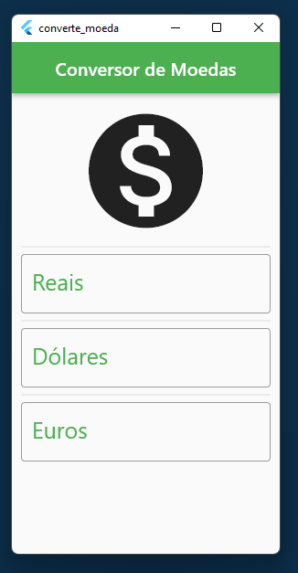
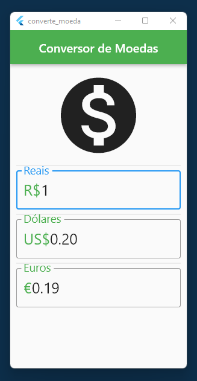
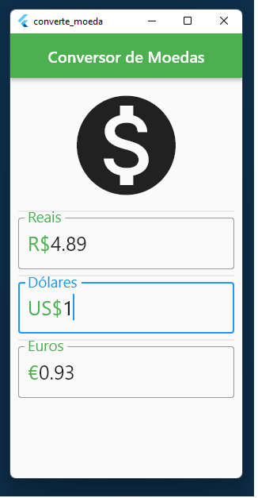
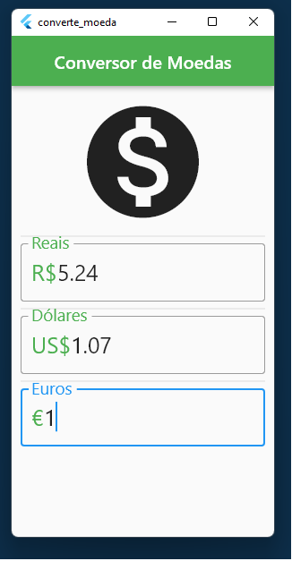
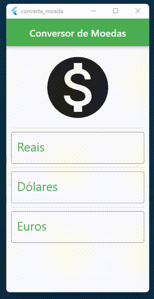

# Conversor de Moeda

Neste	 projeto,	 criamos um	 aplicativo	 que   permite	 o	 usuário	 converter	 moedas	 entre	 diferentes	 moedas	. Trabalhamos com	 interação	 com	 o	 usuário,	 comunicação	 com APIs	externas,	processamento	dos	dados	vindos	de	fontes	externas junto	 aos	 dados	 inseridos	 pelo	 usuário,	 tratamento	 de	 possíveis erros	externos	e	internos	ao	código	da	aplicação	e,	por	último,	mas não	menos	importante,	que	tenha	uma	interface	gráfica	amigável aos	usuários.

## Funcionalidades

O	usuário	poderá	informar	um	valor	em	real,	dólar	ou	euro	e automaticamente	o	aplicativo	vai	buscar	via	uma	API	os	dados	do câmbio	 das	 três	 moedas	 e	 atualizar	 as	 duas	 outras	 de	 maneira	 a haver	 equivalência	 dos	 valores.	 A	 imagem	 a	 seguir	 demonstra como ficou o projeto

#### ARTIGOS RELACIONADOS
[Roadmap Flutter](http://joaopaulomirandamatias.com/portifolio/index.php?class=ArticleView&method=onView&id=1)

#### :mailbox: How to reach me:  

#### 📺: My channel:

